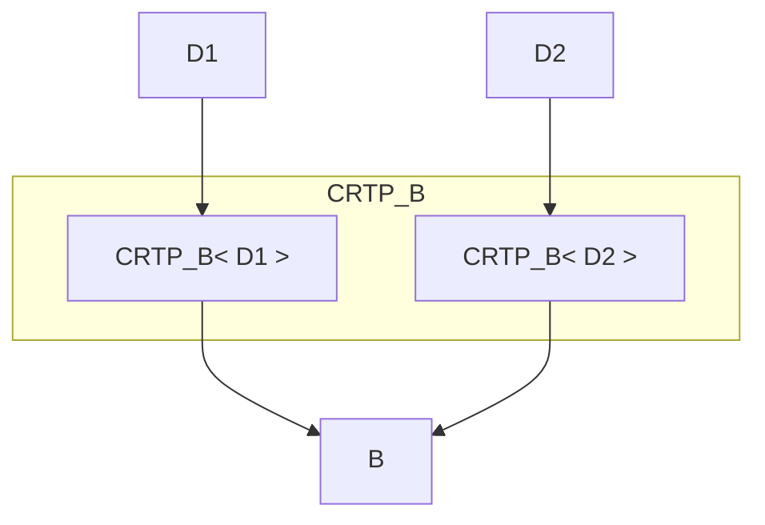
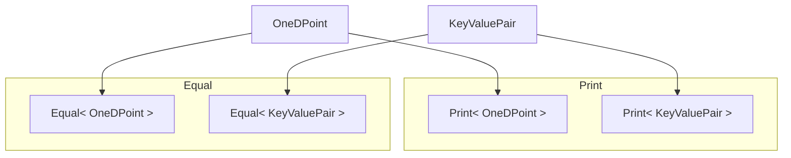
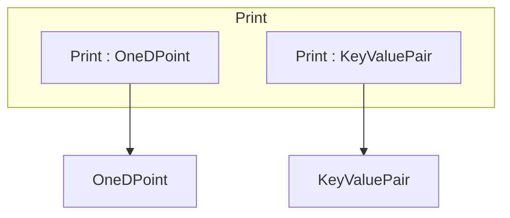

# Mixins and CRTP

Here is an excellent [introduction](https://stackoverflow.com/questions/18773367/what-are-mixins-as-a-concept).

A similar discussion of extending functionality is discussed in [visitor](../visitor/readme.md)


## Basic idea
`CRTP` allows the base class to know who derived from it, so it can `static_cast` to the derived class and call its functions directly.

```cpp
template <typename T>
class Base {
    public:
    int foo () { // note this is not virtual
        static_cast<T*>(this)->foo();
        // static_cast happens at compile time. At runtime, no virtual tables involved
    }

}

class Derived : public Base<Derived> {
    public:
    int foo() {...}
}
```

## Why CRTP

### Static polymorphism: Speedup wrt virtual functions
See `static_poly.cpp`, the `virtual` function example runs in 338ms, while the CRTP equivalent runs in 270 ms.

However we if we had 2 "derived" classes we cannot store them in a vector of base classe pointers like in regular polymorphism (because D1:B<D1> and D2:B<D2> are derived from 2 different classes, B<D1> and B<D2>, and template clases are "invariant"). This can be worked around by having a non templated base class that the CRTP base class inherits from.



### Extension of functionality

We can have some templated Base classes that offer some (shareable) functionality/skills. See `crtp_functionality_extension.cpp` for 2 such skills: printing (`Print`) and Equality check (`Equal`). Two completely separate classes (`OneDPoint` and `KeyValuePair`) inherit both skills

public Equal<OneDPoint>, public Print<OneDPoint>


### Furthur notes
See [this](https://www.sandordargo.com/blog/2024/12/04/crtp-vs-concepts) for some alternative implementations using concepts

## Mixins
A dual view of `crtp_functionality_extension.cpp` is presented in `mixin_functionality_extension`. See [this](https://www.fluentcpp.com/2017/12/12/mixin-classes-yang-crtp/) for more details




This method is meant to be used where we cannot make changes in the original class. Also note if the original class isnt meant for inheritance (non-virtual destructor), then we should not have cases where the derived class is deleted using a pointer to the original/base class
