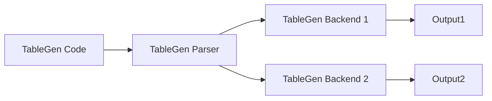
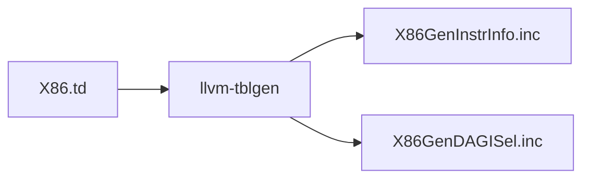

# TableGen

It is a Turing complete, declarative DSL intended to describe the instruction table of a LLVM target mainly for instruction selection. But nowadays its used in a wide variety of roles (instruction scheduling info, declare IR attributes, compiler options etc).

1. DSL for handling large number of records
2. flexible descriptions
3. common features factored out


## Introducing Records

### Syntax
```c
// layout of a template and fields 
class MyClass {
    string Name;
    int X;
}


// define records
def a0 : MyClass {
    let Name = "Hello";
    let X = 1;
}

def a1 : MyClass {
    let Name = "World";
    let X = 50;
}

def a3 : {
    int a = 1;
    int b = 2;
}
```

Simplified notation:
```c
class MyClass <string name, int x> {
    string Name = name;
    int X = x;
}

def a0 : MyClass<"Hello", 1>;
def a1 : MyClass<"World", 50>;
```

#### Available data types
int, string, bool, bit, bits<N>, list<T>, dag (directed acyclic graph)

Example of DAG: `dag foo = (operator arg0, arg1, ...)`

See the enum `RecTyKind`, which contains things like `IntRecTyKind` etc.

### Comparision with OOP and RDBBMS
Unlike OOP: records are immutable and constant. And there are a constant number of records.

Unlike databases: Records do not belong to a table and a strong structure isn't required (for example in the above example `a3` defines its structure on the fly)


## Using Records

Each record when passed to a backend can convert them.



### llvm-tblgen
The `llvm-tblgen` contains many backends such as `InstrInfo`, `DAGISel`, Searchable tables. Default backend just prints out the records. The output files here are C/C++ code. 



All subclasses of `Register`: `llvm-tblgen X86.td -print-enums -class=Register`

## Code

`llvm::Record` represents both records and classes. You can think of records with both key-value specified and class as only keys of the record specified

### Classes/utilities
1. `RecordKeeper`:
    1. `getClasses`: `() -> std::map<std::string, std::unique_ptr<llvm::Record>>`: Get all the classes in TableGen. Name string to Record map
2. `Record`:
    1. `isClass`: `() -> bool`
    2. `isSubClassOf`: `string -> bool`: Accepts a class name as a string.
    3. `getValues`: Returns a iterable of `RecordVal`s
3. `RecordVal`: Each field in a Record
    1. `getType`: `()->RecTyKind`. RecTyKind is an enum of types

## An example with SQL

Because TableGen and RDBMS has a lot of similarities, lets try generating SQL. From [here](https://www.youtube.com/watch?v=UP-LBRbvI_U&ab_channel=LLVM)

### Requirements
#### Table creation
```c
// Tables have primary keys
class Table {
    int PrimaryKey = 0;
}

// subclass from Table
class Customer <string name, string affiliation> : Table {
    int ID = PrimaryKey; // We are saying the value of ID is the variable PrimaryKey
    string Name = name;
    string Affiliation = affiliation;
}
```

This should generate table creation SQL code:
```sql
CREATE TABLE Customer (
    ID int,
    Name varchar(255),
    Affiliation varchar(255),
    PRIMARY KEY (ID)
);
```

#### Insert to table

```c
def rec0 : Customer<"ABC", "DEF">;
```

Above TableGen record should generate the following SQL code. These statements are telling us which columns to insert to and what the values are:
```sql
INSERT INTO Customer (
    ID,
    Name,
    Affiliation
);
VALUES (0, "ABC", "DEF");
```

Cannonical form:
```c
def rec0 {
    int PrimaryKey = 0;
    int ID = 0;
    string Name = "ABC";
    string Affiliation = "DEF";
}
```


### SQL Backend Code

#### Entry point
```c++
int main(int argc, char **argv) {
    cl::ParseCommandLineOptions(argc, argv);
    return llvm::TableGenMain(argv[0], &CallbackFunc);
    // signature of callback:
    // bool f(raw_ostream &OS, RecordKeeper &Records)
    // OS will contain the output SQL code
    // Records: representation of the parsed TableGen code
}
```


#### Creating the table
```c++
bool CallbackFunc(raw_ostream &OS, RecordKeeper &Records) {
    const auto &Classes = Records.getClasses();
    for (const auto &P : Classes) {
        auto ClassName = P.first;
        Record &ClassRecord = *P.second;
        if (!ClassRecord.isSubClassOf("Table")))
            continue;
        OS << "CREATE TABLE" << ClassName << " (";
        for (const RecordVal &RV : ClassRecord.getValues()) {
            OS << "\t" << RV.getName() << " ";
            if (isa<IntRecTy>(RV.getType()))
                OS << "int, ";
            if (isa<StringRecTy>(RV.getType()))
                OS << "varchar(255), ";
        }
        OS << ");\n";
    }

}
```


**TBD**


## More details on TableGen files

1. Classes/abstract records vs records/concrete records. Sometimes records may mean both of them
2. All records have unique names (programmer-provided or generated)
3. Multiple inheritance is possible
4. Backends process a subset of concrete records and emits outputs
5. Typically groups of fields are abstracted out into a class
6. Templates are possible. Eg: `def Child1 : Parent<int, 10>` and `def Child2 : Parent<float, 20>`
7. multiclasses: A "macro" to define multiple concrete records all at once. Multiclasses can inherit from other multiclasses
8. Some C like preprocessor macros are available like #define, #ifdef, #else, #endif, include etc.
9. // or /**/ comments are possible
10. [Keywords](https://llvm.org/docs/TableGen/ProgRef.html#identifiers)
11. [Bang operators](https://llvm.org/docs/TableGen/ProgRef.html#appendix-a-bang-operators). For example: `let FullName = !concat("Hello", "World"); // "HelloWorld"`. These provide string/logical/arithmetic/list utilities. See some example usage in the next item.
12. Types: bit (0/1), int (64 bit), string, code (alias for string), bits<n>, list<type>, dag, ClassID
    1. bits<n>:
        1. Declare: `bits<4> HighBits = 0b1100; bits<4> LowBits = 0b0011;`
        2. Access: `bit FirstBit = HighBits[0]; // 1`
        3. Concat: `bits<8> CombinedBits = !concat(HighBits, LowBits) // 11000011`
        4. Slice: `bits<4> MiddleBits = !slice(CombinedBits, 2, 6); //0000`
        5. Logical: `bits<8> AndResult = !and(HighBits, LowBits); // 0000 // Similarly Or/Xor etc`
    2. list<type>:
        1. Declare: `list<int> ListA = [1, 2]; list<int> ListB = [3, 4];`
        2. Access: `int FirstElement = ListA[0]; // 1`
        3. Concat: `list<int> CombinedList = !listconcat(ListA, ListB); //  [1, 2, 3, 4]`
        4. Size: `int ListLength = !size(ListA); // 4`
        5. Empty: `int IsEmpty = !empty(ListA); // 0 (False)`
        6. Slice: `list<int> SubList = !slice(CombinedList, 1, 3); // [2,3]`
        7. Last: `int LastElement = !last(ListA); // 2`
    3. dag: A nestable DAG. Each node has a operator and >= 0 arguments/operands. Useful for instruction selection code partterns
        1. A class with a dag field: `class Instruction { dag Operands;}`
        2. A concrete record of this class: `def MyInstruction : Instruction {let Operands = (ops "ADD", (ops "R1"), (ops "R2"));}`
    4. ClassID: Useful to define things like `list<Register>`
13. Suffixes: For things like bit access `{}` or list access `[]`. Supports single or ranged access (`...`) or multiple ranges (comma separated). Eg: `value[1,3...5,7,]`. Fields can be accessed with `.`, such as `value.field`
14. [paste](https://llvm.org/docs/TableGen/ProgRef.html#the-paste-operator) operator `#`, to concat strings
15. Debug:
    1. print using: `dump "s = " # !repr(s);`
    2. assert using: `assert !le(!size(name), 32), "person name is too long: " # name;`

### Classes

Simple example
```c++
// abstract class C
class C {
  bit V = true;
}

// Both inherit the "V" field from C
def X : C;
def Y : C {
  let V = false; // overrides "V"
  string Greeting = "Hello!"; // new field
}
```

Parameterized classes (think classes with "constructors")
+
Default values
+
Let overrides (think overrides in the ctor body)
```c++
class MyClass<int val, int N = 10> {
  int value = val;
  int size = N;
  int v = value;
}

// Define a record that uses the default values
def CustomRecord0 : MyClass<42> { } // (42, 10, 42)

def CustomRecord1 : MyClass<32, 20> { } // (32, 20, 32)
def CustomRecord2 : MyClass<32, 20> { 
    let value = 10; // override 32->10 in the body
} // (10,20,10)

def CustomRecord4 : MyClass<?,?> { } // (?,?,value)


// 2 styles of let: inner vs outer
def : MyClass<32, 20> {  // anonymous, name provided by tablegen
    let v = 10; // override 32->10 in the body
} // (32,20,10)

// Outer "defaults" with inner overrides
let size = 20, value = 1 in {
  let v = 50 in {
    def foo : MyClass<32, 20> {} // (1,20,50)
    def bar : MyClass<42, 30> { let value = 100; } // (100,20,50)
  }
}
```

### Multiclasses

Imagine you have to define a deck of cards. It would be cumbersome to write 52 cards definitions (4 suits x 13 numbers). With multiclass we can factor out this and write a multiclass that takes a number and creates 4 cards (one of each suit) in one `defm` call. An example is shown in [multiclass.td](multiclass.td)

A more real world example is shown [here](https://llvm.org/docs/TableGen/ProgRef.html#examples-multiclasses-and-defms), where we have 2 instrution types and 3 instructions.

You can constructed nested cartesian products by having `defm` instead of `def` in the multiclass as shown in [multiclass3d.td](multiclass3d.td)


### def*

defset, deftype, defvar

### Subroutines

```c++
class isSize124<int size> {
  bit ret = !cond(!eq(size,  1): 1,
                  !eq(size,  2): 1,
                  !eq(size,  4): 1,
                  true: 0);
}

def Data1 {
  int Size = ...;
  bit ValidSize = isSize124<Size>.ret;
}
```

### Structured binding
```c++
class ModRefVal <bits<2> val> {
  bits<2> Value = val;
}

def None   : ModRefVal<0>;
def Mod    : ModRefVal<1>;
def Ref    : ModRefVal<2>;
def ModRef : ModRefVal<3>;

class ModRefBits <ModRefVal mrv> {
  // Break the value up into its bits, which can provide a nice
  // interface to the ModRefVal values.
  bit isMod = mrv.Value{0};
  bit isRef = mrv.Value{1};
}

// Example uses.
def foo   : ModRefBits<Mod>;
def bar   : ModRefBits<Ref>;
```

This generates:
```c++
def bar {      // Value
  bit isMod = 0;
  bit isRef = 1;
}
def foo {      // Value
  bit isMod = 1;
  bit isRef = 0;
}
```


## An x86 example
```c++
defm ADD : ArithBinOp_RF<0x00, 0x02, 0x04, "add", MRM0r, MRM0m,
                         X86add_flag, add, 1, 1, 1>;
```


When this expands we get:
```c++
def ADD32rr { // InstructionEncoding Instruction X86Inst I ITy Sched BinOpRR BinOpRR_RF
    int Size = 0;
    string DecoderNamespace = "";
    ...
}
```

The expansion comment shows all the class heirarchy. Leftmost is oldest ancester (InstructionEncoding), rightmost is most recent ancestor (BinOpRR_RF)


## Usage in LLVM

TBD

