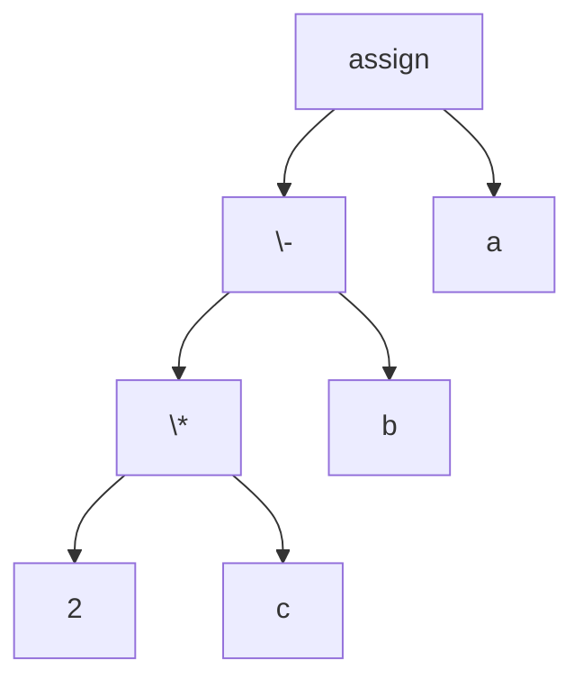
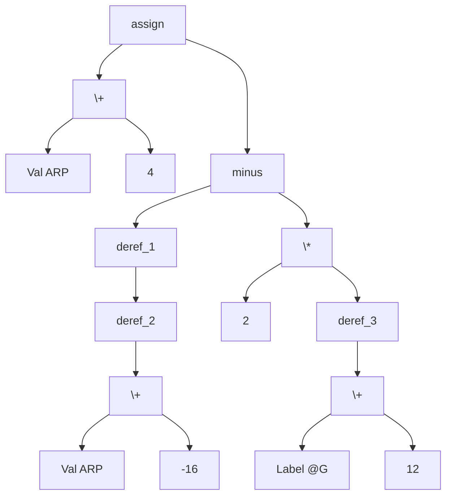
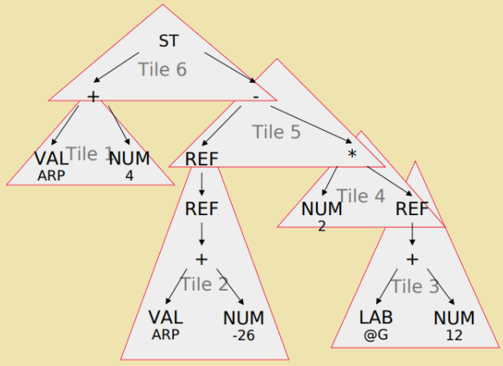
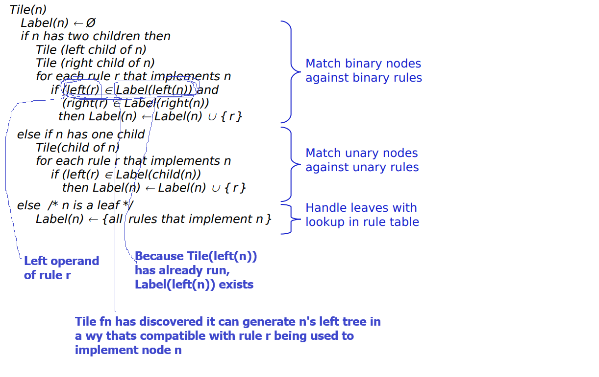

# Instruction Selection

## Intro
1. Many ways to do something: Consider moving $r_i$ to $r_j$, we can do it by a copy, adding 0 to $r_i$ and storing it in $r_j$
2. May try to optimize, run time, code size energy efficiency etc
3. Depending on machine type:
    1. RISC: 1 or 2 assembly for each IR (IR and machine at sam elevel of abstraction)
    2. CISC: many to one mappings (IR is at lower level of abstraction)
    3. Stack machine: one to many mapping (IR is at higher level of abstraction)
4. Two techniques:
    1. Tree walk
    2. Peephole optimization

## Tree walk
1. Simple tree walk generates the same code for every instance of a particular AST node type
    1. Consider `b = a + 1`. A simple tree walker would load `1` to a register, then load `a` to another, and then compute `b`. However this could have been done with "immediate form" instructions like `addi`. But because `+` is always mapped to `add`, simple tree walk misses this opportunity
2. Using a lower level IR that exposes details like "add offset to base address and derefernce it" might help generate better instructions

### Tiling
1. Start with a lower level IR of the program and a collection of small trees each representing the target machine's ISA (**operation trees**).
2. We need to construct a **tiling** of the AST with opertion trees. A node in the AST can be:
    1. The root of a new op tree and the lesf of anothe rop tree (overlap)
    2. A node (inner or leaf) in an op tree
    3. The start node of the AST, which can only be the root of an op tree
    4. No node in the AST is left unaccounted for
3. When 2 tile-trees overlap, they must agree on the storage class (eg, both are using registers)


Consider the program: `a = b - 2*c`

A lowered IR AST might look like:
1. `Val` represents a value in a register, such as the activation record ARP
2. `a` comes from ARP+4
3. `Lab` is a relocatable symbol (an assembly level label for code or data)
4. `c` comes from `*(@G+12)`


A possible tiling is shown here



Some resources for [tiling](https://www.cs.mcgill.ca/~cs520/2023/slides/19-inst_sel_tree_patt.pdf)

### Rewrite rules

A rewrite rule is usually a tuple containing:
1. Tree pattern: $Reg -> +(Reg_1, Reg_2)$
2. Cost: say $1$ for this case. Number of cycles taken to execute this
3. instruction: $add\ r1, r2, r_{new}$

Of course multiple tilings are possible for the same AST. Consider: $deref(+(reg_1, reg_2))$. This can be written as 2 instructions, one addition (shown above) and one dereference. However the ISA might provide $loadA0\ r_1, r_2, r_{new}$ to perform this in 1 shot (at a lower cost than doing add and dereference separately)

### Tiling algorithm
The tiling function recursively calls itself on its children, then checks for each rule $r$ that could implement node $n$, if $r$ left and right are also compatible with the node's left and right.



### Efficiency

#### Precompute

The for loop takes a long time in this algorithm. It could be simplified with a precomputed table. For a binary op, say there are $p$ operation trees, and there are $q$ rules, then there are at max $2^q$ possible label sets, and so the table is of size: $q \times 2^q \times 2^q$. For unary ops its $q \times 2^q$

Also this table is sparse, so techniques could use that fact

#### Computing lowest cost
The tiling algorithm described above computes all possible tilings, but we are interested in the lowest cost ones.

The bottom-up accumulation of cost is a dynamic programming solution of finding minimal cost tiling.


#### Tools
The Tiling algorithm is not used in real life, more optimized methods ar eused such as:
1. DFA based
2. Parsing based
3. String matching based

## Peephole optimization
Generate the assembly, then select a peephole window (number of instructions to look at), and go through the code using this sliding window, optimzing it.

For example:
Store to a location (r_arp+8) and load from the same location
```
storeAI r1,r_arp,8
loadAI r_arp,8,r15
```
can be converted to:
```
storeAI r1,r_arp,8
i2i r1,r15
```
The register to register copy is faster than a load instruction.

Note that is the sole use of the store was for the load, this store can now be removed. However that needs global analysis, beyond the scope of the peephole optimizer


### Stages


### Issues and mitigations
#### Dead values
Generally identifying dead values needs global analysis, but we can use the "Expander" to keep track of liveness. 


Expander processes the code block bottom to top. It can keep track of live variables. For example when processing $r1 = r2\ op\ r3$, it can add $r2$ and $r3$ to "live" and remove $r1$ (because its going bottom to top, $r1$ is rewritten here, so it is not live above this)

Another example of dead code removal: certain ops set the "condition" bit or $cc$
```
r1 = r2 * r3
cc = f(r2,r3)
r4 = r1 + r5
cc = g(r1, r5)
```
The first $cc$ set by the addition is obviously not used, so it can be removed, and that might cause the add/mul to fuse in a single MAC operation.


#### Control flow
The simplifier's window needs to be cleared when it reaches a branch/jump/predicated ops/labelled instruction. Looking at more context could help on a case by case basis and a full reset might be avoided (eg track use of labels (again by the expander), and eliminate them if they are no longer referenced).


#### Window size
A larger window may provide more opportunities. Also we may have adjacent ops not operating on same values. If machine has more instruction level parallelism, we might generate independent/interleaved computations. To counter this, the peephole optimizer might use a "logical" window, rather than a fixed physical window. The expander can keep track and provide info (like a linkedlist) to the simplifier to point to the next usage.

