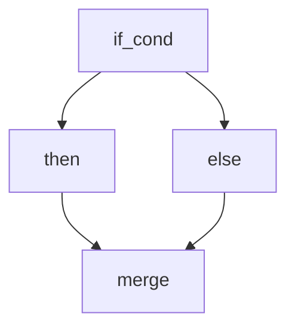
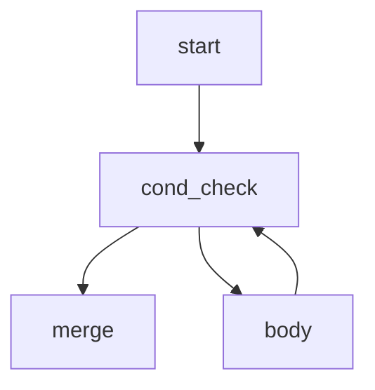
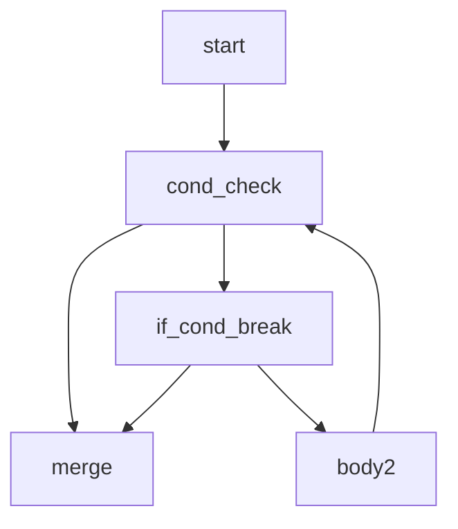
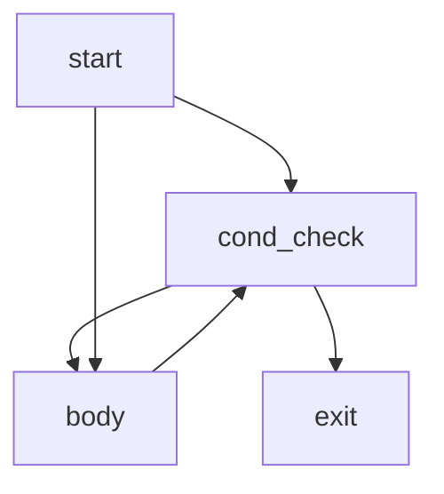
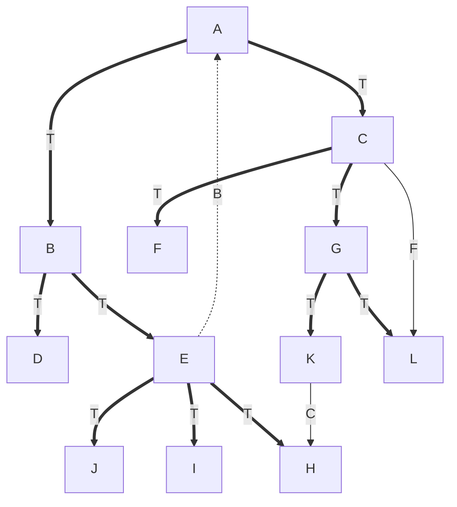
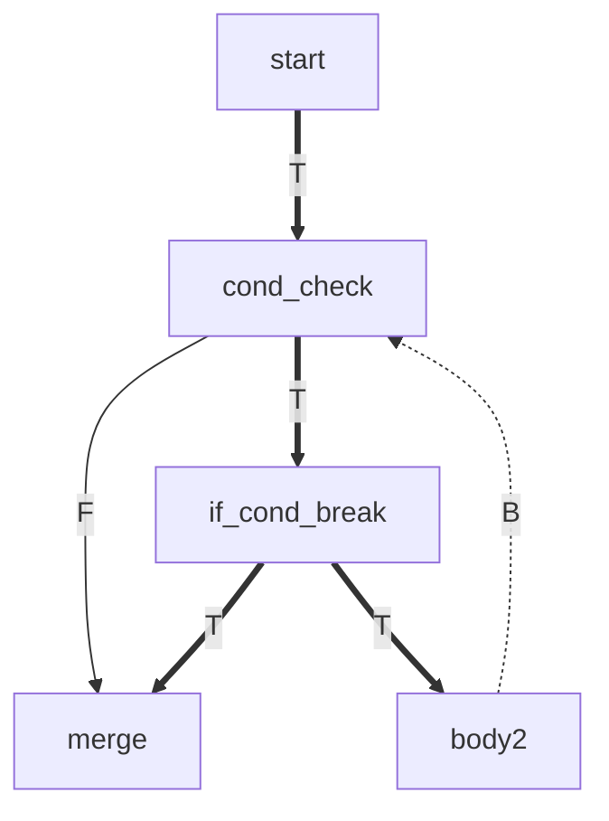
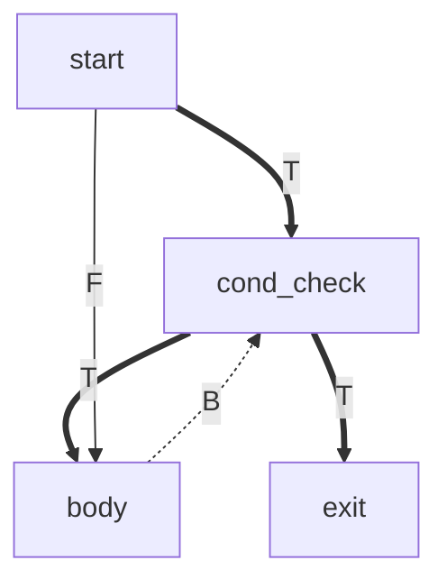
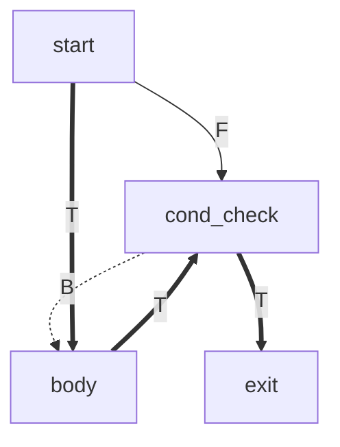
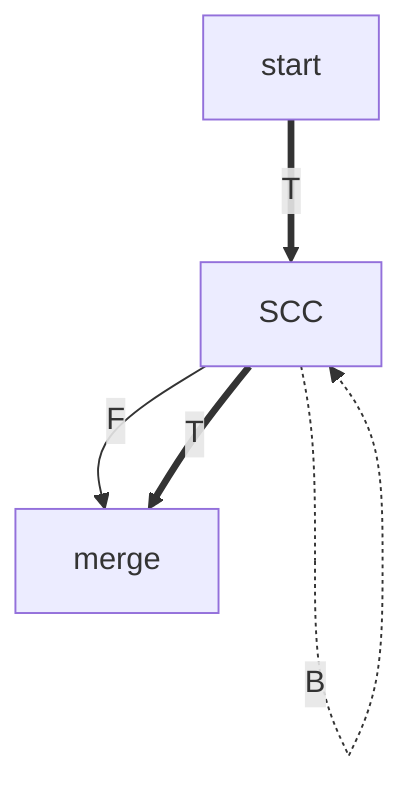
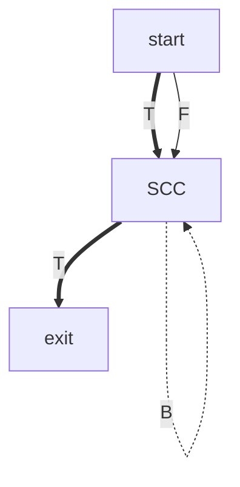

# Control flow graphs

## Basic block
Straight line sequence of code with single entry and exit. By single exit we mean, there is 1 exit instruction, but that may lead to 2 different paths (eg, the if condition check in an if-then-else)

## CFG Construction
Each node represents a "basic block". The graph represents all possible code flow paths. 

Thus if we have a graph of raw instructions we can perform edge contraction for all nodes with $indegree = outdegree = 1$

## Examples

Mostly we are dealing with "reducible" CFGs. Here are some common [examples](https://en.wikipedia.org/wiki/Control-flow_graph#/media/File:Some_types_of_control_flow_graphs.svg)

### Structured

#### if-then-else

#### for loop

#### loop with conditional break in body

### Irreducible

An example of an irreducible graph has unstructured control flow goto

## Theory
See [this](https://rgrig.blogspot.com/2009/10/dtfloatleftclearleft-summary-of-some.html)

These are equivalent:

1. It is reducible (definition: it does not have a strongly connected subgraph with two (or more) entries)
2. Every [back edge has its source dominated by its target](###Intuition), for all DFS trees.
3. It has a [unique DFS dag](###Intuition)
4. It can be [transformed into a single node](###Transformation-to-single-node) by repeated application of the transformations T1 and T2:
    1. $T1$: Remove a back-edge.
    2. $T2$: Pick a non-initial node y that has only one incoming edge x → y and glue nodes x and y.

At this point we have an intuitive understanding, but lets take some ([loop with break](####loop-with-conditional-break-in-body) vs [loop with goto](###Irreducible)) and go through some of these criterias. Lets call them $G_{break}$ and $G_{goto}$ respectively.

### Understanding DFS

Consider the graph shown here, with its edges classified.
1. Tree edges: These are the actual DFS discovery path. A spanning tree. 
2. Back edges: These are edges from descendent nodes, back to ancestors
3. Forward edges: A "shortcut" node to descendents. Note if a differnt DFS path was chosen the classification of cross/forward/tree edges might have changed. Consider the graph $A->B; B->C; A->C$, we could have $A->B->C$ as the tree (and $A->C$ as the forward edge) or $A->B; A->C$ as the tree (and $B->C$ as a cross edge).
4. Cross edges: Neither descendents or ancestors.

### Intuition

"Well behaved" graphs have the following properties
1. Loops are "strongly connected components" (SCC) because you can go from its entry point to body back to entry point
2. Loops have only 1 entry point
3. Thus if we reduce the SCC to a single node, we will have a DAG

Marking the forward edge and the back edge it is clear $G_{break}$ has a unique DFS DAG

However $G_{goto}$ has 2 as shown below:

Note, $G_{break}$ has a SCC loop with a single entry. Therefore any backedge in the loop will point to the single entry point,a nd by definition if we are inside the loop, we must have entered it through that single entry point. Thus the edge is guaranteed to be classified as a "back edge". Also the backedge's source is the single entry point, hence it is guaranteed that the entry point will dominate the source of the backedge

For $G_{goto}$, we have 2 entry points, thus we can have 2 DAGs depending on where we choose to enter

### Multi entry SCC

Consider $G_{break}$. $cond_check$, $if_cond_break$ and $body2$ form a SCC. Lets replace them with a new node $SCC$. Keeping the old edges for clarity. We see the SCC has a single entry point.

For $G_{goto}$, the SCC is made of $body$ and $cond_check$. Replacing them with new node $SCC$. We see the SCC has 2 entry points.

### Transformation to single node

TBD