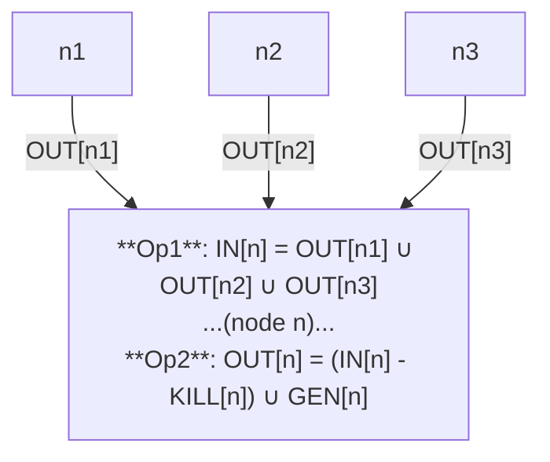

# Data flow analysis

## Introduction and Theory
Give a label "n" to each node in the program.
$IN(n)$ / $OUT(n)$ denotes a set of facts at the entry/exit of node $n$.

Data flow analysis computes $∀n, IN(n), OUT(n)$. It does so by applying 2 operations till $IN(n)$ and $OUT(n)$ stop changing (reaches saturation or fixed point)

### In/Out calculation



$IN[n]$ is calculated as:

$$
IN[n] =\bigcup_{n^{'} \in pred(n)} OUT[n^{'}]
$$

$OUT[n]$ is calculated as:


$$
OUT[n] = (IN[n] - KILL[n]) \bigcup GEN[n]
$$

Or


$$
OUT[n] = Transfer_n(IN[n])\\
IN[n] = Join_{n^{'} \in pred(n)}(OUT[n^{'} ])
$$

### Simple examples


| Statement | Gen | Kill | Comment
| -------- | ------- | ------- | ------- |
| `print(x)` | $∅$ | $∅$ | Thus $IN[n] == OUT[n]$
| `x = 5` | ${<x,n>}$ | ${<x,m>: m!=n}$ | Kill all definitions of `x` other than the one generated right now |


### Chaotic iteration Algorithm
Initialization:
Start with $\forall n, IN[n] = ∅, OUT[n] = ∅$.
Set output of entry node: $OUT[entry] = {<v, ?> : v\ is\ a\ program\ variable}$. This denotes we have so-and-so variables, but we know nothing about them.

Iteration:
Iterate through each node in the graph (in any order) updating $IN[n]$ and $OUT[n]$. $IN[entry]$ and $OUT[exit]$ are ignored and not calculated


Termination:
Stop when nothing is changing for all nodes

Note this algorithm is guaranteed to converge and stop because  .... TBD ......................

### Lattices
The 2 operations are always monotonic ($IN$ and $OUT$ never shrink, they always grow). The largest these sets can get is number of definitions in the program, so they cannot grow forever.

A finite height lattice with a monotonic transfer function is guaranteed to terminate.


### Classifying different analyses

#### Forward vs Backward
Information may flow forward or backward. Thus we have a choice of what $pred(n)$ is

#### May or Must
The $\bigcup$ notation for $IN[n]$ computation might represent "may" (union) or "must" (intersection). "May" analysis computes facts if those hold along some path in the CFG, while "Must" analysis computes facts that hold along all paths

```python

def get_analyser(forward, may):
    '''
    forward: Set to True for fwd analysis, False for backward
    may: Set to True for "may" analysis, False otherwise
    '''
    op = union if may else intersection
    input_to_in = predecessor if forward else successor
    def analyser(node):
        in_n = op(input_to_in(node))
        out_n = union((in_n - kill(n, in_n)), gen(n))
        return in_n, out_n

```

Here is the 2x2 table. Some may not fit (requiring bidirectional analysis)

|     | May | Must |
| -------- | ------- |  ------- |
| **Forward**  | Reaching definitions    | Available expressions
| **Backward** | Live variables     | Very busy expressions


## Example walkthrough
With lattice


TBD examples of some data flow analyses