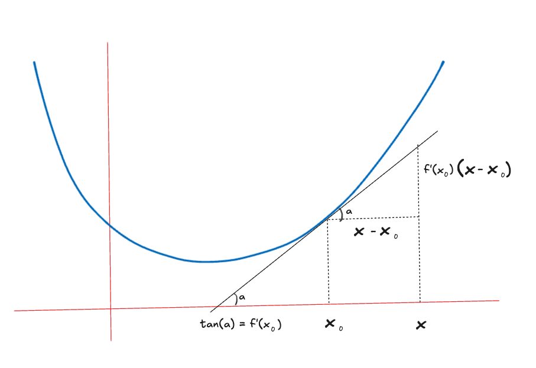

# Markov's inequality

For a non negative RV $X \ge 0$ and some $a > 0$

$$
\boxed{
\begin{aligned}
P(X \ge a) \le \frac{\mathbb{E}[X]}{a}
\end{aligned}
}
$$

## Proof

$$
\mathbb{E}[X] = \sum_{x}x P(X=x)
$$

$$
\ge \sum_{x \ge a}x P(X=x)
$$

$$
\ge a \sum_{x \ge a} P(X=x)
$$

$$
= a P(X \ge x)
$$

## Intuition
1. The probability that $X$ is very large is bounded by its mean
2. As $a$ increases the probability decreases
3. This is the weakest bound, but thats expected, as it only uses mean. If we used variance, we could get tighter bounds, which brings us to...

# Chebyshev's inequality

For any random variable $X$ with mean $\mu = \mathbb{E}[X]$ and variance $\sigma^2 = \mathrm{Var}(X)$, for any $k > 0$:

$$
\boxed{
P(|X - \mu| \ge k\sigma) \le \frac{1}{k^2}
}
$$

Or equivalently, for any $a > 0$:

$$
\boxed{
P(|X - \mu| \ge a) \le \frac{\sigma^2}{a^2}
}
$$

## Proof

$$
P(|X - \mu| \ge a) = P((X - \mu)^2 \ge a^2)
$$

Now apply Markov's inequality as the RV $(X - \mu)^2 \ge 0$

$$
P((X - \mu)^2 \ge a^2) \le \frac{\mathbb{E}((X - \mu)^2)}{a^2} = \frac{\sigma^2}{a^2}
$$

## Intuition
1. Provides tighter bounds than Markov's inequality as it uses $\sigma$
2. Chebyshev's inequality is Markov's bound on squared deviation

# Cantelli's inequality

Also known as One sided Chebyhev bound, where we are trying to bound $P(X - \mu \ge t)$

For $t>0$

$$
\boxed{
P(X - \mu \ge t) \le \frac{\sigma^2}{\sigma^2 + t^2}
}
$$

$$
\boxed{
P(X - \mu \le -t) \le \frac{\sigma^2}{\sigma^2 + t^2}
}
$$

## Proof

Start with a shifted RV $Y=X - \mu$ and then consider the non negative $Z = (Y+\lambda)^2$. Now apply Markov's bound on $Z$

Note mean of $Y$ is $0$ and $Var(Y) = \sigma^2 = Var(X)$ (which is used in the expansion of $\frac{\mathbb{E}[(Y+\lambda)^2]}{(t+\lambda)^2}$ below)

$$P(Y \ge t) = P(Y + \lambda \ge t + \lambda) = P((Y + \lambda)^2 \ge (t + \lambda)^2) \le \frac{\mathbb{E}[(Y+\lambda)^2]}{(t+\lambda)^2} = \frac{\sigma^2 + \lambda^2}{(t+\lambda)^2}$$

We want the tightest bound so minimize RHS wrt $\lambda$ by differentiation and setting to $0$. We get $\lambda = \frac{\sigma^2}{t}$. Plugging this back in completes the proof

## Intuition
1. Tighter than Chebyshev's

# Jensen's inequality

For a convex function $f$ and a random variable $X$:

$$
\boxed{
f(\mathbb{E}[X]) \leq \mathbb{E}[f(X)]
}
$$

## Proof

Pick a point $x_0$ on a convex curve. For any other point $x$ on the curve, it lies above the tangent at $x_0$:

$$
f(x) \ge f(x_0) + f^{'}(x_0)(x-x_0)
$$

Let $x_0 = \mathbb{E}[x]$, and then take expectations on both side to finish the proof

# Hoeffding's inequality

Here we bound the probability of the sum of $n$ independent RVs from deviating from their mean

For independent random variables $X_1, X_2, \ldots, X_n$ such that $a_i \le X_i \le b_i$, let $S_n = X_1 + X_2 + \cdots + X_n$ and $\mu = \mathbb{E}[S_n]$. Then for any $t > 0$:

$$
\boxed{
P(S_n - \mu \ge t) \le \exp\left( -\frac{2t^2}{\sum_{i=1}^n (b_i - a_i)^2} \right)
}
$$

Similarly,

$$
\boxed{
P(|S_n - \mu| \ge t) \le 2\exp\left( -\frac{2t^2}{\sum_{i=1}^n (b_i - a_i)^2} \right)
}
$$

## Proof

Let $S_n = X_1 + X_2 + ... + X_n$

The expectation of the sum is $\mu = \mathbb{E}[S_n] = \sum_{i}{\mathbb{E}[X_i]}$ by linearity of expectation

Next we apply Markov bound to the exponential. Here $s>0$

$$
P(S_n - \mu \ge t) = P(e^{s(S_n-\mu)} \ge e^{st}) \le \frac{\mathbb{E}[e^{s(S_n - \mu)}]}{e^{st}} = \frac{\mathbb{E}[\prod_{i}{e^{s(X_i-\mathbb{E}[X_i])}}]}{e^{st}}
$$

Since $X_i$ are independent, we can swap product and expectation

$$
\prod_i\mathbb{E}[e^{s(X_i-\mathbb{E}[X_i])}]
$$

The next few steps are not fully fleshed out here, but its
1. Use Hoeffding's lemma to bound zero mean $Y_i = X_i - \mathbb{E}[X_i]$
2. Combine the bounds in the product
3. optimize s to make the term as small as possible
4. Plug back the optimal s

## Intuition
1. Note the very tight exponential decay (unlike the polynomial decay of Chebyshev)
2. Working out the chebyshev bound of sum of RVs is a good exercise
3. Note Chebyshev does not assume independence or bounds on values of the RVs

# Chernoff bound

For independent Bernoulli random variables $X_1, X_2, \ldots, X_n$ with $X_i \in \{0,1\}$ and $\mathbb{E}[X_i] = p_i$, let $S_n = X_1 + X_2 + \cdots + X_n$ and $\mu = \mathbb{E}[S_n] = \sum_{i=1}^n p_i$. Then for any $0 < \delta < 1$:

$$
\boxed{
P(S_n \ge (1+\delta)\mu) \le \left( \frac{e^\delta}{(1+\delta)^{1+\delta}} \right)^\mu
}
$$

## Proof
In the proof instead of using Hoeffding's lemma we use

$$
\mathbb{E}[e^{s(X_i-\mathbb{E}[X_i])}] = \mathbb{E}[e^{s(X_i-p_i)}] = p_ie^s + (1-p_i)
$$

## Intuition
1. This is a specialization of Hoeffding's for coin flips.
2. The secret sauce is in evaluating the expectation exactly (unlike in Hoeffding's where Hoeffding's lemma is used)

# A common theme

For a RV $Y$ and $s>0$, exponentiate and apply Markov bound

$$
P(Y \ge t) = P \left( e^{sY} \ge e^{st} \right) \le \frac{\mathbb{E}[e^{sY}]}{e^{st}} 
$$

1. Choose $Y$
2. bound or compute the expectation $\mathbb{E}[e^{sY}]$
3. Optimize over $s$

## Markov
$Y=X, s=1$, and use $e^x \ge x$

## Chebyshev
$Y=(X-\mu)^2$

## Cantelli
$Y = X-\mu$, bound the expectation by Taylor's series

## Hoeffding

$Y=S_n-\mathbb{E}[S_n]$, then use independence to factorize + Hoeffdings' lemma to bound

## Chernoff

Exactly evaluate the expectation for Bernoulli.

## Bernstein

Similar to Hoeffding's but uses different assumptions and hence a different bounding of the expectation

# Comparision with CLT
TODO