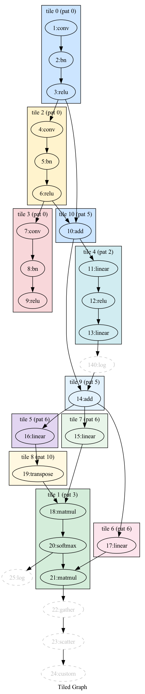

# DAG Tiler

Tile a PyTorch compute graph using a library of reusable pattern subgraphs.

Given a "big" graph (e.g. a traced LLM) and a library of small patterns
(e.g. `linear->relu`, an attention block), the tiler finds the best
covering: **maximize coverage first, then prefer fewer, larger tiles.**

## Quick start

```python
from graph import Graph
from solver import tile

# Define graphs with the compact DSL
big = Graph.from_spec("1:mm->2:relu->3:mm->4:relu")
lib = [Graph.from_spec("1:mm->2:relu")]

result = tile(big, lib)
print(result.fully_tiled)  # True
print(len(result.tiles))   # 2
```

### With PyTorch models

```python
from fx_adapter import trace_to_graph

model = nn.Sequential(nn.Linear(4, 8), nn.ReLU(), nn.Linear(8, 4), nn.ReLU())
big = trace_to_graph(model)

lib = [Graph.from_spec("1:linear->2:relu")]
result = tile(big, lib)
# result.fully_tiled == True, 2 tiles
```

### PyTorch-level API (compiled-binary stitching)

If you have compiled binaries for small library modules and want to stitch
them into a big model, use `pt_tiler` — it accepts `nn.Module` objects
directly and returns stitching-oriented results:

```python
from pt_tiler import tile_model

model = TwoBlockModel(dim=16)
library = [GatedResidualBlock(16)]   # you have compiled binaries for these

result = tile_model(model, library, debug_dir="my_debug")

for t in result.tiles:   # tiles in topological (execution) order
    print(f"library[{t.library_index}] covers {sorted(t.covered_nodes)}")
    print(f"  inputs from: {t.input_nodes}")    # wire these into the binary
    print(f"  outputs to:  {t.output_nodes}")   # capture these from the binary
    print(f"  node map:    {t.node_mapping}")    # big_node -> library_node
```

See [`example_pt.py`](example_pt.py) for a full runnable example with
stitching pseudocode.

### Visualization

```python
dot = big.to_dot_with_tiling(result, title="My Model")
with open("output.dot", "w") as f:
    f.write(dot)
```
```bash
dot -Tpng output.dot -o output.png
```

Tiles appear as coloured clusters; uncovered nodes are dashed gray.



### Debug mode

Pass `debug_dir` to `tile()` to dump detailed logs and graphs into a folder:

```python
result = tile(big, lib, debug_dir="debug_output")
```

see [docs/debugging.md](docs/debugging.md) for more details

## The DSL

```
"1:mm->2:relu->3:add"       chain: mm → relu → add
"1:mm->3:add; 2:relu->3"    branch: mm → add, relu → add
```

- `id:type` defines a node. `id` alone references an existing node.
- `->` creates an edge. `;` separates chains.
- Edge declaration order determines input slot position.

## Key features

| Feature | How |
|---|---|
| Maximize coverage | Backtracking solver with memoization |
| Prefer large tiles | Tiles sorted largest-first; fewer tiles wins ties |
| Partial coverage | Uncovered nodes reported in `result.uncovered` |
| Output constraint | Pattern must declare outputs for escaping values — see [docs](docs/assumptions_and_edge_cases.md#1-forgetting-to-set-pattern-outputs) |
| Commutativity | `add` and `mul` match regardless of input order |
| Op aliasing | `operator.add`, `torch.add`, `Tensor.add_`, `x.add()` all become `"add"` |
| Visualization | Graphviz DOT with coloured tile clusters |
| Debug mode | `tile(big, lib, debug_dir="...")` dumps logs + DOT/PNG per phase |

## Files

| File | Purpose |
|------|---------|
| [`graph.py`](graph.py) | Lightweight DAG class, DSL parser, DOT output |
| [`matcher.py`](matcher.py) | Subgraph pattern matching with commutativity |
| [`solver.py`](solver.py) | Backtracking tiler with memoization |
| [`fx_adapter.py`](fx_adapter.py) | PyTorch FX → Graph conversion |
| [`pt_tiler.py`](pt_tiler.py) | PyTorch-level wrapper for compiled-binary stitching |
| [`example.py`](example.py) | Runnable walkthrough — **start here** |
| [`example2.py`](example2.py) | Runnable walkthrough for a more complex graph |
| [`example_pt.py`](example_pt.py) | PyTorch-level API example with stitching plan |
| [`test_solver.py`](test_solver.py) | 42 tests for core solver logic |
| [`test_fx.py`](test_fx.py) | 14 tests for FX integration |

## Docs

Detailed documentation lives in [`docs/`](docs/):

- **[`algorithm.md`](docs/algorithm.md)** — Deep dive into matching,
  backtracking, memoization, complexity analysis, worked example
- **[`assumptions_and_edge_cases.md`](docs/assumptions_and_edge_cases.md)** —
  What the tiler assumes, what it handles, and what can trip you up
- **[`architecture.md`](docs/architecture.md)** — Two-layer design,
  data flow, key classes, how to extend
- **[`debugging.md`](docs/debugging.md)** — Detailed debugging of
  internal steps

## Running tests

```bash
pip install torch pytest
python -m pytest test_solver.py test_fx.py test_model.py -v
```
