# Example Walkthrough: Backtracking in Action

This walks through `example3.py` step by step, showing how the solver
backtracks from a greedy choice to find the optimal tiling.
All images are from `debug_output3/`, produced by running:

```python
python example3.py
```

---

## The Setup

**Big graph** (8 nodes):

```
1:conv -> 2:bn -> 3:relu -> 4:conv -> 5:bn -> 6:relu -> 7:custom
                  3:relu -> 8:pool
```

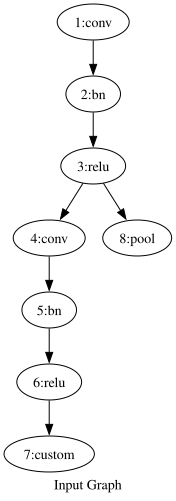

Node `7:custom` has no library pattern -- it will always be uncovered.
The interesting question is whether `8:pool` gets covered.

**Library** (3 patterns):

| Index | Pattern | Size |
|-------|---------|------|
| pat 0 | `conv -> bn -> relu` | 3 |
| pat 1 | `relu -> pool` | 2 |
| pat 2 | `conv -> bn` | 2 |

<details>
<summary>Pattern visualizations</summary>

| pat 0 | pat 1 | pat 2 |
|-------|-------|-------|
| 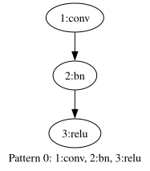 | 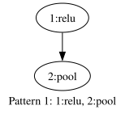 | 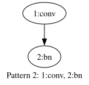 |

</details>

---

## Phase 1: Candidate Enumeration

The matcher finds **5 candidate placements**:

| Candidate | Pattern | Covers | Size |
|-----------|---------|--------|------|
| C0 | pat 0: `conv->bn->relu` | {1, 2, 3} | 3 |
| C1 | pat 0: `conv->bn->relu` | {4, 5, 6} | 3 |
| C2 | pat 1: `relu->pool` | {3, 8} | 2 |
| C3 | pat 2: `conv->bn` | {1, 2} | 2 |
| C4 | pat 2: `conv->bn` | {4, 5} | 2 |

The key conflict: **C0 and C2 share node 3:relu**. Picking one blocks the other.

<details>
<summary>Candidate visualizations (each candidate highlighted on the big graph)</summary>

| C0: {1,2,3} | C1: {4,5,6} | C2: {3,8} | C3: {1,2} | C4: {4,5} |
|-------------|-------------|-----------|-----------|-----------|
| 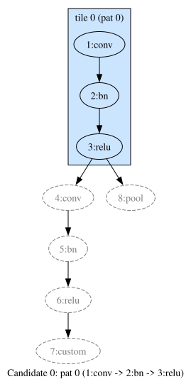 | 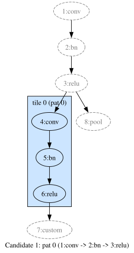 | 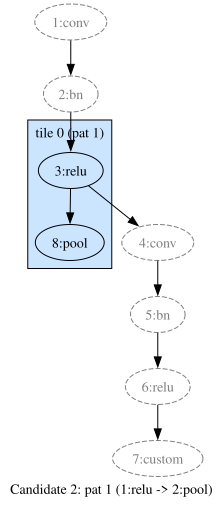 | 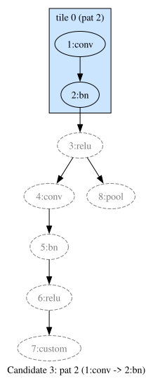 | 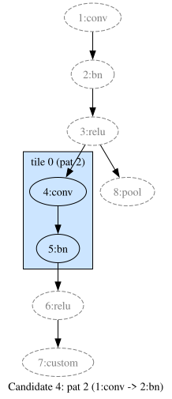 |

</details>

---

## Phase 2: Backtracking Search

### Why greedy fails

A greedy approach (always pick the largest tile) would choose:
1. C0 `{1,2,3}` (size 3) -- covers conv->bn->relu on the left
2. C1 `{4,5,6}` (size 3) -- covers conv->bn->relu on the right

**Coverage = 6/8**. Node `8:pool` is left uncovered because C0 "stole"
node `3:relu` from C2.

The optimal solution is:
1. C1 `{4,5,6}` (size 3) -- conv->bn->relu on the right
2. C2 `{3,8}` (size 2) -- relu->pool
3. C3 `{1,2}` (size 2) -- conv->bn on the left

**Coverage = 7/8**. Only `7:custom` (unsupported) is uncovered.

The solver must **backtrack** from the greedy C0 to discover that
the smaller C3 + C2 combination covers one more node overall.

### The search trace

The solver uses most-constrained-first node selection. Here is the
full trace (from `search.txt`), annotated:

#### Step 0: Skip the unsupported node

```
pick node 7:custom  (0 covering tiles, 8 uncovered remain)
  skip 7:custom
```

Node `7:custom` has zero candidate tiles. The solver immediately
skips it -- this node will never be covered.

**Remaining: {1, 2, 3, 4, 5, 6, 8}** (7 nodes)

#### Steps 1--10: First branch (skip 8:pool, skip 6:relu)

The solver picks `8:pool` next (1 covering tile -- most constrained).
For each node, the solver considers two options: leave it uncovered, or
place a tile on it. Here it first explores the branch where both `8:pool`
and `6:relu` are **left uncovered**, to see how well it can tile the rest.
Deep in this branch, it assembles tiles bottom-up:

| Step | Action | Coverage so far |
|------|--------|----------------|
| 1 | Try C4 `{4:conv, 5:bn}` | 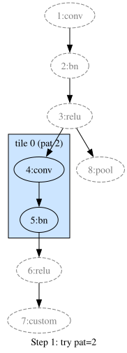 |
| 2 | New best: cov=2, tiles=1 | 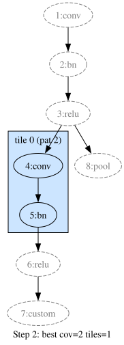 |
| 3 | Try C0 `{1:conv, 2:bn, 3:relu}` | 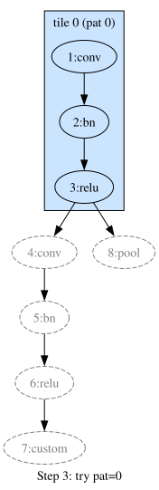 |
| 6 | New best: **cov=5, tiles=2** | 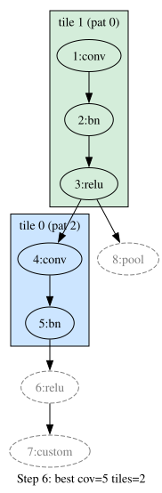 |

At step 6, the solver has found C0 `{1,2,3}` + C4 `{4,5}` = coverage 5.
But 6:relu and 8:pool are still uncovered.

Then it tries C1 `{4,5,6}` instead of C4:

| Step | Action | Coverage so far |
|------|--------|----------------|
| 7 | Try C1 `{4:conv, 5:bn, 6:relu}` | 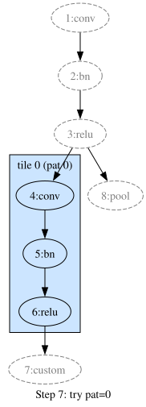 |
| 8 | Try C0 `{1:conv, 2:bn, 3:relu}` | 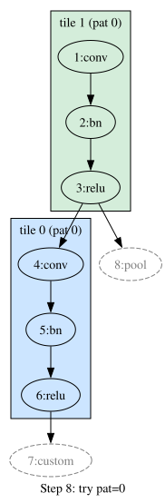 |
| 10 | New best: **cov=6, tiles=2** | 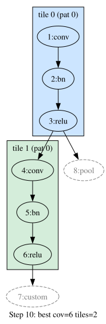 |

Coverage 6 with C1 + C0. Better! But node `8:pool` is still uncovered.

#### Steps 11--20: The backtracking payoff

Now the solver **backtracks** all the way up to node `8:pool` and
tries the **cover** branch -- tile C2 `{3:relu, 8:pool}`:

| Step | Action | Coverage so far |
|------|--------|----------------|
| 11 | Try C2 `{3:relu, 8:pool}` | 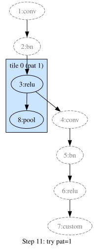 |

By choosing C2, node `3:relu` is now taken. This means C0 `{1,2,3}` is
**no longer available** (node 3 is already covered). The solver is forced to
use the smaller C3 `{1,2}` instead.

It then explores how to cover the remaining nodes {1, 2, 4, 5, 6}:

| Step | Action | Coverage so far |
|------|--------|----------------|
| 14 | Try C4 `{4:conv, 5:bn}` | 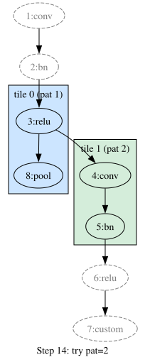 |
| 17 | New best from subproblem: cov=4, tiles=2 | 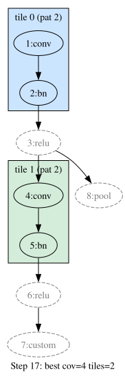 |
| 18 | Try C1 `{4:conv, 5:bn, 6:relu}` | 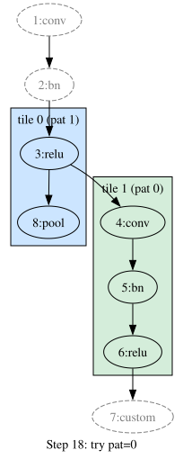 |
| 19 | New best from subproblem: cov=5, tiles=2 | 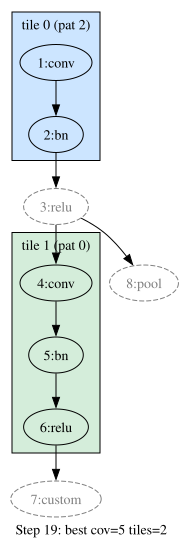 |

Finally, combining C2 with the best subproblem result:

| Step | Action | Coverage |
|------|--------|----------|
| 20 | **New global best: cov=7, tiles=3** | 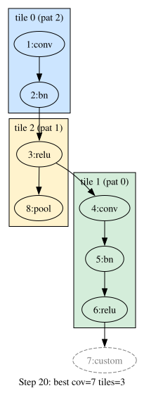 |

**Coverage 7 > 6**. The solver prunes (full sub-coverage of the
remaining 7 nodes) and returns.

---

## Result

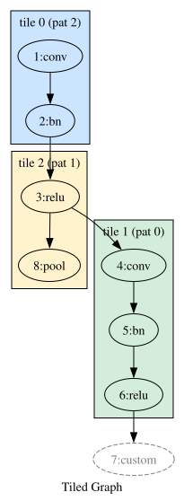

| Tile | Pattern | Covers |
|------|---------|--------|
| 0 | pat 2: `conv->bn` | {1:conv, 2:bn} |
| 1 | pat 0: `conv->bn->relu` | {4:conv, 5:bn, 6:relu} |
| 2 | pat 1: `relu->pool` | {3:relu, 8:pool} |

**Coverage: 7/8** (only `7:custom` uncovered -- no pattern exists for it).

### The lesson

The greedy choice (C0, the 3-node `conv->bn->relu` covering {1,2,3})
looks locally optimal -- it's the largest tile for node 3. But it
**blocks** C2 (`relu->pool` covering {3,8}), which would cover the
otherwise-unreachable node 8.

The solver discovers this by:
1. First exploring the "skip 8:pool" branch and finding cov=6
2. Backtracking to try "cover 8:pool with C2" and finding cov=7
3. Recognizing 7 > 6 and keeping the C2-based solution

This is the value of backtracking over greedy: it considers the
**global** impact of each tile choice, not just the local size.

---

## Bonus: Memoization

Notice the `memo hit` entries in the search trace. For example, at
line 18 (`try C1 {4,5,6}`), the solver hits a memo for uncovered
size=2 -- it had already solved the subproblem {1:conv, 2:bn} earlier
(step 5) and reuses that answer instantly. In this small example it
saves a few recursive calls; in real models with repeated blocks, it
can collapse exponential search into polynomial time.
