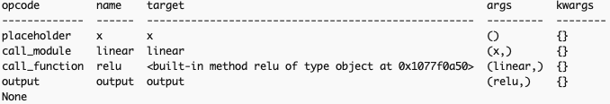

# Table of Contents

- [Pytorch fx tutorials](#pytorch-fx-tutorials)
- [Basic functionality](#basic-functionality)
    - [Class structure](#class-structure)
        - [traced: torch.fx.graph_module.GraphModule](#traced-torchfxgraph_modulegraphmodule)
        - [traced.graph: torch.fx.graph.Graph](#tracedgraph-torchfxgraphgraph)
            - [Graph manipulation](#graph-manipulation)
            - [Print/codegen](#printcodegen)
        - [Nodes: torch.fx.node.Node](#nodes-torchfxnodenode)
        - [fx.Transformer](#fxtransformer)
        - [Pass manager](#pass-manager)
        - [Subgraph matcher](#subgraph-matcher)
- [Common idioms](#common-idioms)
    - [Traversal](#traversal)
    - [Filter](#filter)
    - [Create nodes](#create-nodes)
    - [Edit graph](#edit-graph)
    - [Inserting node before after](#inserting-node-before-after)
    - [Replacing all nodes](#replacing-all-nodes)
    - [Pattern match and replace](#pattern-match-and-replace)
    - [Observer](#observer)
    - [Custom Tracer](#custom-tracer)
- [How it works under the hood](#how-it-works-under-the-hood)

# Pytorch fx tutorials

Intro from [torch.fx](https://docs.pytorch.org/docs/stable/fx.html)
[Passes](https://docs.pytorch.org/docs/stable/torch.compiler_transformations.html)


# Basic functionality


```bash
python 1_basic_usage.py
```

Output
```bash
FX Graph:
graph():
    %x : [num_users=1] = placeholder[target=x]
    %linear : [num_users=1] = call_module[target=linear](args = (%x,), kwargs = {})
    %relu : [num_users=1] = call_function[target=torch.relu](args = (%linear,), kwargs = {})
    return relu
Output: tensor([[0.7985, 0.0000]], grad_fn=<ReluBackward0>)

Nodes in the FX graph:
x
linear
relu
output
```

1. The IR is SSA, and indeed looks similar to LLVM's IR
2. `num_users` rerfers to the number of nodes that use this node downstream
3. Note `call_module` for `nn.module`s and `call_function` for functional torch

## Class structure

### traced: torch.fx.graph_module.GraphModule
 1. A GraphModule is subclassed from nn.Module
 2. It contains a field `graph` of type `torch.fx.graph.Graph`
 3. call `recompile()` after graph transformations

### traced.graph: torch.fx.graph.Graph


#### Graph manipulation
1. nodes:
    1. `nodes`: iterable of `torch.fx.node.Node`
    2. `erase_node`
    3. `node_copy`
    4. `find_nodes`
    5. create nodes: `placeholder`, `call_function`, `call_method`, etc, which are convenience wrappers on `create_node`
2. Rewire nodes:
    1. `replace_all_uses_with`
    2. `replace_input_with`
3. post transformations:
    1. `eliminate_dead_code()`: useful after graph transformations, to get rid of dead code
    2. `lint()`: check graph correctness


#### Print/codegen
1. `print_tabular()`: pretty print, see sample below
2. `python_code(node)`: generates python code


### Nodes: torch.fx.node.Node
1. `op` field describes what type of `Node` it is. See table below
2. `target` field specifies what is being invoked
3. `args`/`kwargs`: input `Node`s to a `Node`. but can also be numbers, tuples, list etc
    1. For example `x.view(2,3)` would produce `args` with `Node` `x`, but also literal numbers 2, 3
    2. `torch.cat([x, y], dim=1)`: here we will have `dim` in `kwargs`
4. `users`: Number of downstream `Node`s this `Node` feeds
5. `name`: a string name
6. `graph`: Point to parent graph, useful for inserting new nodes
7. `meta`:  arbitrary dictionary of data
8. `normalized_arguments`: normalize `args`/`kwargs`, so we can compare patterns like `torch.add(x, y)`, `x+y`, `torch.add(input=x, other=y)` on the same footing
9. `format_node()`: pretty print a node, producing output like `'%relu : [num_users=1] = call_function[target=torch.relu](args = (%linear1,), kwargs = {})'`
10. Navigation: There are 2 separate concepts: DAG dependency (partial order) and a concrete topological sorting (total order) into a linked list.
    1. DAG Dependency: `node.args`, `node.kwargs`, `node.all_input_nodes`
    2. Traverse the concrete topologically sorted doubly linked list using `node.next` and `node.prev`. Here a node has exactly 1 prev and 1 next (a total order)
11. Replace/rewrite nodes:
    1. `node.replace_all_uses_with(new_node)`: Replace all uses of `node` with `new_node`. But doesn't delete `node`, just disconnects it from its consumers. Can call `graph.erase_node(node)` after to delete `node`
    2. `node.replace_input_with(old_node, new_node)`: `old_node` might be present in `node`'s `args`/`kwargs`. Replace all instances of it with `new_node`
    3. `node.prepend(other_node)`: Insert before
    4. `node.append(other_node)`: Insert after
    5. `update_arg` / `update_kwarg`


| op            | Description                               | Example                                   |
|---------------|-------------------------------------------|-------------------------------------------|
| placeholder   | Input argument to the graph               | `x`                                       |
| call_function | Calls a free function                     | `torch.relu(x)`                           |
| call_method   | Calls a method on an object               | `x.view(-1)`                              |
| call_module   | Calls a submodule                         | `self.linear(x)`                          |
| get_attr      | Reads an attribute from the Module        | `self.weight`                             |
| output        | Outputs the result of the graph           | `return y`                                |


`print_tabular`




### fx.Transformer
`Transformer` is a helper class for fx graph rewrites. See examples in [Transformer Idioms](#transformer-idioms)

### Pass manager
We can have "analysis" vs "rewrite" passes, and `PassManager` lets us have a way of controlling the order, number of times, constraints, post-pass sanity checks in applying passes

### Subgraph matcher
We can define a pattern graph, and a repalcement graph and `subgraph_rewriter.replace_pattern` can automatically perform the replacements.

### Subclassing Transformer
We can even subclass Transformer, and override behaviour of ops.
```
python 5_fx_transformer_pattern_replace.py
# This shows an example x+0 -> x replacement is done in 2 ways. the first way is by subclassing Transformer
```

# Common idioms

## Traversal

```python
for node in graph.nodes:
    print(node.name, node.op, node.target)
```

## Filter
```python
add_nodes = [n for n in graph.nodes if n.op == "call_function" and n.target == torch.add]

add_nodes_1 = graph.find_nodes(lambda n: n.op == "call_function" and n.target == torch.add)
```

## Create nodes
```python
with graph.inserting_after(existing_node):
    relu_node = graph.call_function(torch.relu, args=(existing_node,), kwargs={})
```

This is a wrapper on the lower level `create_node`
```python
new_node = graph.create_node(op="call_function", target=torch.relu, args=(existing_node,), kwargs={})
```


## Edit graph
1. `node.replace_input_with(old_node, new_node)`
2. `node.replace_all_uses_with(new_node)`
3. `graph.erase_node(node)`


### Inserting node before after:
For multiple nodes use the context manager
```python
with graph.inserting_after(node):
    new_node = graph.call_function(torch.relu, args=(node,), kwargs={})
    
with graph.inserting_before(node):
    new_node = graph.call_function(torch.sigmoid, args=(node,), kwargs={})
```

For a single node there are convenience functions:
```python
node.prepend(other_node)
node.append(other_node)
```


### Replacing all nodes

```python
for node in graph.nodes:
    if node.op == "call_function" and node.target == torch.add:
        # replace with fused operation
        new_node = graph.call_function(fused_add_mul, args=node.args)
        node.replace_all_uses_with(new_node)
graph.eliminate_dead_code()
gm.recompile()
```


### Pattern match and replace

A manual example:
```bash
python 2_pattern_match_and_replace.py
```

`subgraph_rewriter.replace_pattern` is a higher level utility that
1. Finds all matching subgraphs
2. Creates replacement nodes
3. Rewires consumers
4. Removes old nodes

Example:
```bash
python 3_fx_transformer_pattern_replace.py
```

This shows 2 ways of making the x+0->x replacement, first by subclassing `Transformer`, second by `subgraph_rewriter.replace_pattern`


`replace_pattern_with_filters` is another useful variant.

## Observer

1. Find the node of interest
2. Attach a new node before it to observe its outputs

```bash
python 4_observer.py
```

Original graph
```
a ----\
        mul  --->  relu  ---> output
b ----/
```


After `replace_all_uses_with`
```
a ----\
        mul      (mul still exists)
b ----/

obs ---> relu ---> output
```

After `obs_node.args = (target_node,)` or `replace_input_with`
```
a ----\
        mul ---> obs ---> relu ---> output
b ----/

```

## Custom Tracer
`Tracer` class could be subclassed, and the following methods could be overridden to control tracing behaviour:
1. `is_leaf_module`: By default, modules in torch.nn are treated as leaves. Override this to treat more modules as leafs (i.e., not traced inside)
2. `call_module`
3. `getattr`
4. `create_args_for_root`: Creating `placeholder` nodes


# How it works under the hood

FX replaces tensors with `Proxy`, which is a fake tensor, whose job is to record (creating graph nodes) what we do to it, by intercepting Python ops like `__add__`, `__getitem__`, `__call__` etc. When tracing ends, the proxy goes away, and we are left with the graph

1. Pt code: `x.mean(dim=1)`
2. `x.mean`: Since `x` is a `Proxy` this is executed: `Proxy.__getattr__(x, "mean")`, which returns a new callable `Proxy`
```
def __getattr__(self, attr):
    return Attribute(self, attr)   # 'mean' becomes an Attribute Proxy
```
3. The call with `dim=1`, executes `Attribute.__call__`, which does `new_node = graph.call_method("mean", args=(x.node,), kwargs={"dim": 1})`, creating a new node.
4. This node is wrapped in a new `Proxy` and returned: `return Proxy(new_node)`