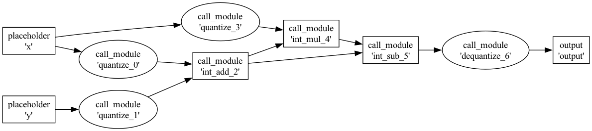
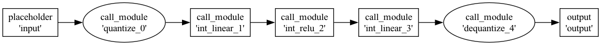
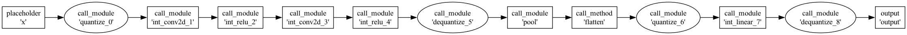
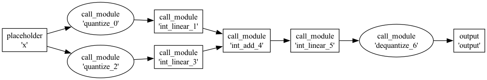
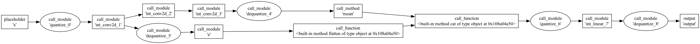
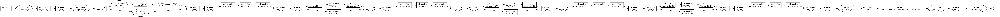

# Quantization Simulation

**This is still wip**

This folder contains a standalone quantization simulation framework implemented in `quantization_simulate.py`. The framework uses `torch.fx` to trace PyTorch models, insert observers to collect min/max statistics during calibration, and then rewrites the graph into an integer-backed model (int8) to simulate quantization arithmetic and measure accuracy loss.


## Overview

`quantization_simulate.py` implements `QuantizationSimulator`, a class that automates:

1. FX tracing of a given `nn.Module`.
2. Insertion of `ObserverModule` nodes to collect min/max activation statistics during calibration runs.
3. Computation of quantization parameters (scale, zero_point) using symmetric quantization rules.
4. Graph rewriting to replace supported ops with integer-mode equivalents (e.g., `IntLinear`, `IntConv2d`, `IntAdd`). The `Int` modules take care of output rescaling if needed
5. Optional dequantize insertion for boundaries between quantized and non-quantized regions.
6. Output comparison metrics (MSE, MAE, max error, relative error) between the original float model and the simulated quantized model.


## Code steps
- Instantiate `QuantizationSimulator(model, dtype=QuantDtype.INT8)`
- Call `prepare_for_observation(example_inputs)`
- Call `calibrate(calibration_data)`
- Call `convert_to_quantized()`
- Optionally call `compare_outputs(test_input)` to get error metrics


## Quick start / Examples


```bash
python run.py
HF_TOKEN=xxx pytest test.py
```


## Quantization regions

### Arithmetic
```
a = x + y
b = a * x
c = a - b
```


### Sequential


### Sequential with unsupported
Note the unsupported `flatten` op at the end which forces a dequantization



### Simple branch



### Resnet
The unsupported average pool causes a dequant at the end, but everything else before that is correctly identified to be a long chain of quantized ops


## TODO
The quantize reqion identification/coalescing mostly works. But accuracy etc has issues (indicating `int_modules.py` needs more attention)


- refactor the Int modules to have the common code in 1 place
    - like checking inp dtype
    - requant at the end if needed
- Write proper tests
- `x = y + 4` will not work (consts in addition etc)
- Resnet accuracy issue
- a long if-else tree in `convert_to_quantized`, could use a refactor
- simplify:
    - assume sym quant and remove code that handles non-sym
    - assume its all int8 quant
- add sanity check to make sure each path in the graph has "balanced paranthesis" structure
- slightly diff approach: requant is being done in Int modules. maybe we add them explicitly? in fact maybe we add nodes to manip the inp/out and leave the add/subtract etc as is?
