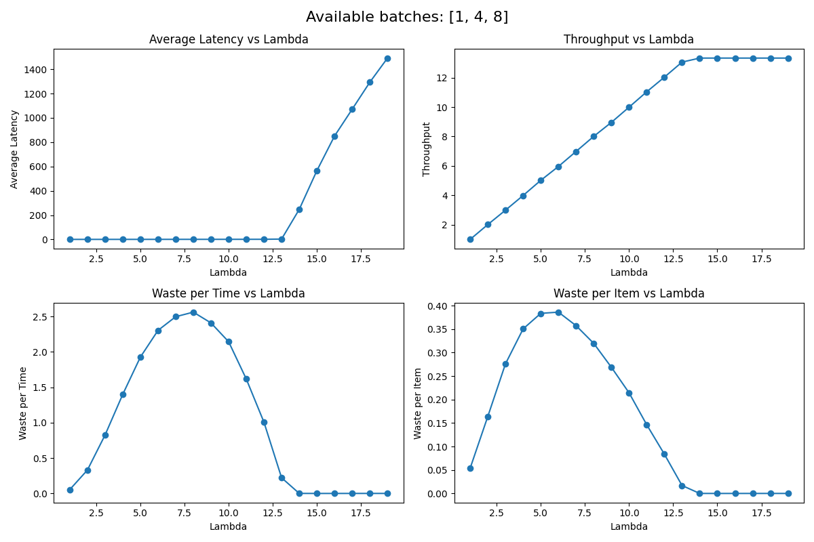

# Simulating a batching system

## Setup/Description/Specs
1. Inputs arrive as a poisson process
2. The system is: ->batcher->model
3. Batcher:
    - The batcher has a set of available batches it can output `AVAILABLE_BATCHES`, say [1,4,8]
    - It finds the smallest number >= the existing number of requests in the input queue. Of course, if thats > max possible batch size, it outputs max possible batch size
4. The model runtime is an increasing function of batch. Here we assume linear
5. we are interested in latency, thruput and "waste" metrics. Because we pad a batch to some number in `AVAILABLE_BATCHES`, some of the data being processed is padded data, so that is wasted computation


# SimPy fundamentals

SimPy has 3 fundamental concepts:
1. `Environment` (env) – the discrete-event scheduler. The simulation progresses by jumping from one scheduled `Event` to the next, advancing the simulation time. It is an `Event` priority queue, and decides which processes to wake up next
2. `Process` – user-defined logical threads. Decides it needs to wait for something to finish, then it creates an `Event` and `yield`s it
3. `Event` – things processes wait on (timeouts, queue ops, resources), indicating something has happened or needs to happen. When a process yields an `Event`, it tells this process till the event is triggered


## Sample code

```bash
python batch.py
```

` env.timeout` is the entry point, the `queue` connects the 2 processes. `arrivals` `put`s in the `queue`, while `batcher` `get`s from it. The code is extensively commented for more details

### Results
We vary lambda, the arrival rate and see the effect of latency, thruput




1. Latency stays low, till the system is overloaded. Once the inputs keep piling up, latency grows unboundedly
2. Throughput increases with increasing input rate, till it hits a wall (the compute bound of the system)
3. At very high levels of lambda waste is very low, because the inputs always have enough to create the largest possible batch.
4. For lower lambdas, the exact shape of the waste graph depends on the available buckets


## Theoretical analysis
For max batch=8, the time to run is: `0.05*8 + 0.2 = 0.6`
This is the limiting case (when lambda is high)

This we are processing `8` elements in `0.6` units of time, so throughput is `8/0.6 = 13.33`

In the experiment graph we see that at lambda around 13, the system becomes unstable/unbounded as expected.


## TODO:
We might have a max batchsize and a max number of batches. Given that, whats the possible bucketing (values of `AVAILABLE_BATCHES`) so that padding "waste" is reduced for a given lambda